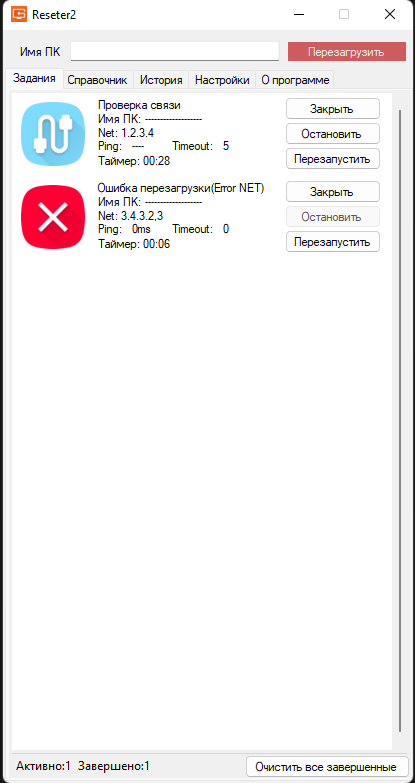
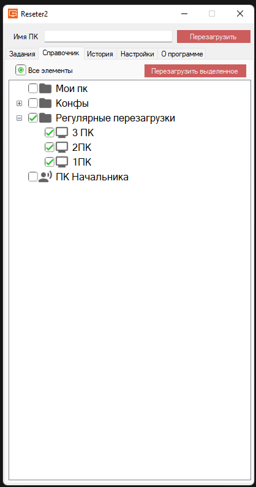
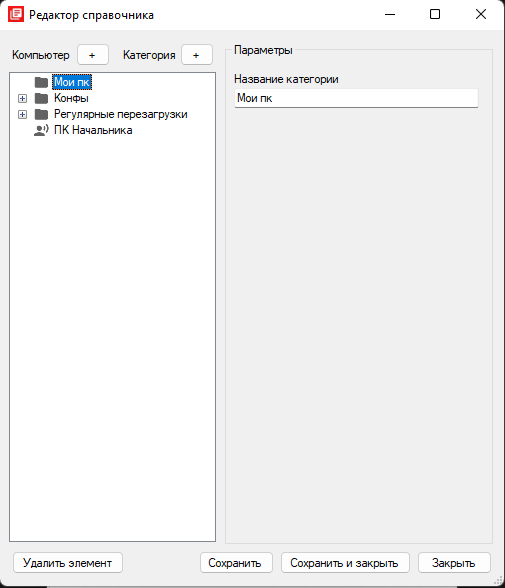

# Reseter2

Reseter2 - Windows-приложение для администраторов, которое помогает массово перезагружать компьютеры в сети и контролировать выполнение каждой задачи.

Программа рассчитана на одновременную работу с несколькими ПК: можно находить компьютеры по имени, IP-адресу, логину пользователя или ФИО через SCCM, добавлять их в очередь перезагрузки, отслеживать статус каждой машины и сохранять историю операций.

## Возможности

- Массовая одновременная перезагрузка Windows-компьютеров.
- Добавление нескольких ПК в очередь задач.
- Удаленная перезагрузка компьютеров по имени или IP-адресу.
- Поиск компьютеров через SCCM по имени ПК, логину или ФИО пользователя.
- Локальный поиск по истории ранее выполненных операций.
- Проверка доступности компьютера перед перезагрузкой.
- Контроль процесса перезагрузки через повторные ping-проверки.
- История операций с компьютером, пользователем, статусом и временем выполнения.
- Настраиваемые списки и категории компьютеров для быстрого доступа.
- Настройки подключения к SCCM.
- Настройки таймаутов перезагрузки и размера истории.

## Скриншоты

### Контроль и очередь статусов задач

 

### Редактор справочника
 


## Требования

- Windows
- Visual Studio
- .NET Framework 4.7.2 Developer Pack / Targeting Pack
- Сетевой доступ к целевым компьютерам
- Права на удаленную перезагрузку компьютеров
- Опционально: доступ к SQL-базе SCCM для поиска компьютеров

## Как это работает

1. Пользователь вводит имя компьютера, IP-адрес, логин или ФИО.
2. Приложение ищет подходящие компьютеры через SCCM или локальную историю.
3. Администратор добавляет один или несколько ПК в очередь перезагрузки.
4. Для каждой задачи программа проверяет доступность компьютера.
5. На целевые ПК отправляется команда удаленной перезагрузки.
6. Приложение одновременно отслеживает состояние всех активных задач через ping.
7. Результаты операций сохраняются в локальную историю.

## Запуск проекта

1. Склонируйте репозиторий:

```bash
git clone https://github.com/your-user/Reseter2.git
```

2. Откройте `Reseter2.sln` в Visual Studio.

3. Соберите решение.

4. Запустите проект.

5. При необходимости настройте подключение к SCCM:

- адрес SQL Server;
- имя базы SCCM;
- Windows-аутентификацию или логин/пароль SQL-пользователя.

## Локальные файлы данных

Приложение сохраняет настройки, историю и пользовательские категории в локальные файлы:

- `res.dat`
- `base.wb`

Эти файлы относятся к локальному состоянию приложения и не обязательны для изучения исходного кода.

## Важные замечания

Для удаленной перезагрузки нужны соответствующие права Windows на целевом компьютере. В доменной среде приложение следует запускать от учетной записи, которой разрешено удаленно перезагружать рабочие станции.

Поиск через SCCM зависит от структуры базы, используемой в проекте.

